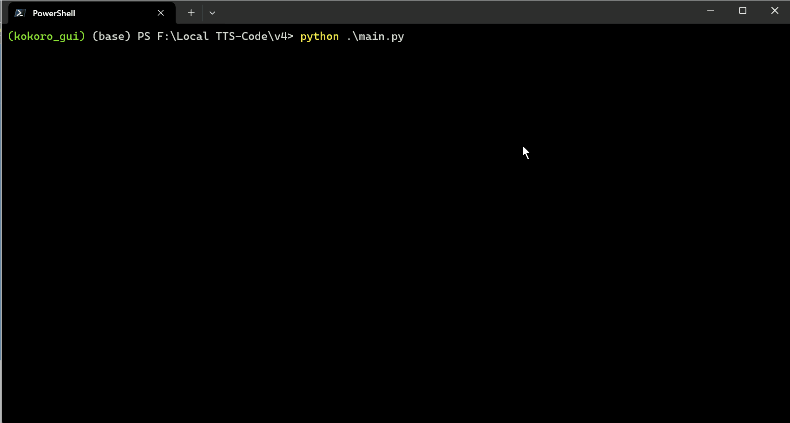
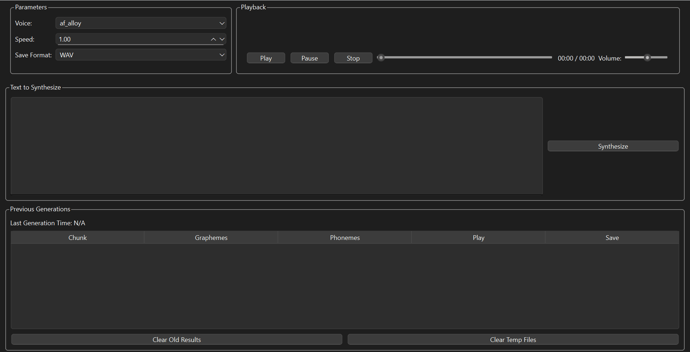

# Kokoro TTS Local GUI - pySide6

## Overview
This application is a user-friendly, Python-based Text-to-Speech (TTS) demo that integrates **Kokoro TTS** for high-quality, efficient speech synthesis. The GUI is built using **PySide6 (Qt for Python)** and allows editing text, adjusting parameters, and playing synthesized audio.

Key Features:
- Automatic phoneme conversion using Misaki G2P and fallback eSpeak-ng.
- Phoneme editing (planned) for fine control of TTS output.
- Multiple voices (downloaded as .pt voice models) that can be switched at runtime.
- **Adjustable speed** parameter.
- Audio playback, pause, resume, stop, and waveform preview.
- Ability to **save** generated audio in WAV or MP3.
- Automatic cleanup of temporary audio files older than a certain threshold.

## Demo & Usage

Here’s a quick look at **Kokoro TTS Local GUI** in action:



The following animation shows how to adjust parameters and synthesize speech:



## Requirements
Below is the recommended environment configuration to run this application:

- **Python** version: **3.8 to 3.11**
  - We recommend **Python 3.11** specifically if you plan on using CUDA. At the time of writing, **Python 3.12** is not officially supported by PyTorch/CUDA. If you require GPU support, use 3.8 through 3.11.
- **PyTorch** with CUDA (optional): If you have a GPU and want acceleration.
- The required dependencies are listed in [requirements.txt](./requirements.txt). Install them via:

```bash
pip install -r requirements.txt
```

For CUDA support, ensure you have the appropriate **NVIDIA drivers** and **CUDA Toolkit** installed, and that your PyTorch build supports CUDA.

## Installation & Setup

1. **Clone or download** this repository.
2. **Install Python** (3.8 - 3.11 recommended). 
3. **(Recommended)** Create a dedicated environment (virtualenv or conda) to avoid dependency conflicts:
   ```bash
   # Using venv
   python -m venv kokoro_gui
   source kokoro_gui/bin/activate  # Linux/Mac
   kokoro_gui\Scripts\activate    # Windows
   # or using conda
   conda create -n kokoro_gui python=3.11
   conda activate kokoro_gui
   ```
4. **Install dependencies** in that environment:
   ```bash
   pip install -r requirements.txt
   ```
5. (Optional) If you have a GPU:
   ```bash
   pip install torch --extra-index-url https://download.pytorch.org/whl/cu118
   ```
   (Adjust cuda version to your system, e.g. cu117, cu118, etc.)
6. **Download/Check voice models**:
   - The application automatically downloads missing voice models on first run.
   - By default, they are stored in a local `voices` folder.

## Usage
To launch the GUI:

```bash
python main.py
```

### Command Line Arguments
- `--config <path>`: Specify a config YAML file for TTS settings.

## File Structure

- **main.py**: Entry point. Parses arguments, then starts the GUI.
- **ui_main.py**: Implements the PySide6 user interface.
- **tts_wrapper.py**: Manages Kokoro TTS pipeline, including loading voices and generating audio.
- **models.py**: Handles voice downloading, caching, and loading for Kokoro TTS.
- **persistence.py**: Loads/saves metadata about generated audio, preserving session data.
- **temp_cleanup.py**: Automatically removes stale temporary files.
- **requirements.txt**: Required dependencies.
- **error_handler.py**: Simple GUI error dialog.

## Workflow
1. **Enter Text** in the GUI.
2. **Select Voice** and Speed.
3. **Click Synthesize**.
4. **Playback** generated audio chunks or combined output.
5. **Save** any chunk or the combined file in WAV or MP3.
6. **Clear** old results or temporary files as needed.

## Known Issues & Troubleshooting
- **Voice Download Failures**: If a voice fails to download, ensure you have a stable internet connection and that [huggingface-hub](https://github.com/huggingface/huggingface_hub) is installed.
- **CUDA not detected**: Double-check that you installed the correct PyTorch wheel with CUDA support and that your graphics drivers are up to date.
- **Python 3.12**: At this time, some dependencies (like CUDA or certain libraries) may not fully support Python 3.12. Using Python 3.11 or lower is recommended.
- **eSpeak-ng Configuration on Windows**: If you need eSpeak-ng for non-English phonemization, you may need to set environment variables manually so that `phonemizer` can locate the `libespeak-ng.dll`:
  ```powershell
  [System.Environment]::SetEnvironmentVariable("PHONEMIZER_ESPEAK_PATH", "C:\\Path\\to\\espeak-ng", [System.EnvironmentVariableTarget]::Machine)
  [System.Environment]::SetEnvironmentVariable("PHONEMIZER_ESPEAK_LIBRARY", "C:\\Path\\to\\espeak-ng\\libespeak-ng.dll", [System.EnvironmentVariableTarget]::Machine)
  ```
  Make sure to open a **new terminal** or log out/in so the changes can take effect.
- **Voice Listing Bug**: On some systems, the newly downloaded voices may not appear until you close and relaunch the application.

## Fun Facts
You Don't need **CUDA** - **Kokoro** Is super fast!

If you generate text only on English - Ignore eSpeak-ng warrning.

## License
This project is distributed under the [MIT License](LICENSE) (or insert your own license details here).

## Contributing
Feel free to open issues, submit PRs, or suggest improvements!

